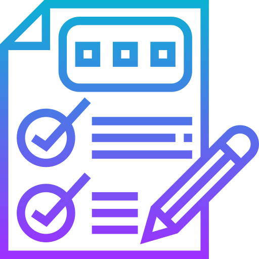

<!-- LOGO -->
 

  

<h1 align="center">Examen</h1>

  

    Contrôle des connaissances
     
    <a href="https://github.com/sqqyqqh/intro-blockchain/issues">Reporter un bug</a>
    —
    <a href="https://github.com/sqqyqqh/intro-blockchain/issues">Demander une amélioration</a>
  

## ✅ Q.C.M. (20 questions)
> Consigne : le Q.C.M. est à faire __individuellement__, avec l'aide des ressources du cours. Il n'existe qu'une seule bonne réponse par question. Chaque réponse correcte rapporte 1 point, chaque réponse incorrecte retire 1 point et les questions sans réponses sont considérées comme nulles dans la notation. Vous devez envoyer les réponses aux questions par message à formateur_sayah.el-yatim@supdevinci-edu.fr, avant la limite de temps, et sous cette forme :

---
OBJET : Q.C.M. - Initiation à la Blockchain

{NOM}, {Prénom}, {Classe}, {Matière}

Réponses : 1-a, 2-abc, 3-be, etc...

---

### Questions

1. Quel concept clé de la blockchain traite de la sécurité des données grâce à des techniques de chiffrement?
   - a. Décentralisation
   - b. Cryptographie
   - c. Contrats intelligents
   - d. Registres distribués
   - e. Immuabilité
   - f. Consensus

2. Quels sont les trois types de blockchains présentés dans la formation?
   - a. Publiques
   - b. Privées
   - c. Hybrides
   - d. Consortium
   - e. Centralisées
   - f. Décentralisées

3. Où la blockchain trouve-t-elle des applications dans le domaine de la finance?
   - a. Systèmes de paiement
   - b. Échanges de crypto-actifs
   - c. Marchés de la supply chain
   - d. Ventes au détail
   - e. Gestion de projet
   - f. Ressources humaines

4. Quel domaine est couvert lors de la troisième journée de formation?
   - a. Finance et commerce
   - b. Énergie et environnement
   - c. Internet des objets et gestion de l'identité
   - d. Cryptographie avancée
   - e. Contrats intelligents
   - f. Registres distribués

5. Comment la blockchain peut-elle être utilisée dans l'IoT selon la formation?
   - a. Pour sécuriser les communications entre les objets connectés
   - b. Pour gérer les identités numériques
   - c. Pour automatiser les transactions financières
   - d. Pour stocker des données personnelles
   - e. Pour créer des contrats intelligents
   - f. Pour décider du consensus dans un réseau

6. Quel terme décrit la caractéristique d'irréversibilité des transactions dans la blockchain?
   - a. Décentralisation
   - b. Cryptographie
   - c. Immuabilité
   - d. Consensus
   - e. Contrats intelligents
   - f. Registres distribués

7. Dans quel domaine la blockchain peut-elle être utilisée pour les systèmes de trading d'énergie?
   - a. Finance et commerce
   - b. Énergie et environnement
   - c. Internet des objets
   - d. Gestion de l'identité
   - e. Santé
   - f. Éducation

8. Qu'est-ce qui caractérise une blockchain publique?
   - a. Contrôlée par une seule entité
   - b. Ouverte à tous et transparente
   - c. Limitée à un groupe restreint d'utilisateurs
   - d. Utilise un consensus centralisé
   - e. Conçue pour des applications internes uniquement
   - f. Basée sur des contrats intelligents

9. Quel terme désigne la méthode utilisée pour atteindre un accord sur l'état du réseau dans une blockchain?
   - a. Décentralisation
   - b. Cryptographie
   - c. Consensus
   - d. Immuabilité
   - e. Registres distribués
   - f. Contrats intelligents

10. Quel est l'objectif principal de la gestion de l'identité avec la blockchain?
    - a. Faciliter la surveillance gouvernementale
    - b. Assurer la confidentialité totale des informations
    - c. Gérer les identités numériques de manière fiable et sécurisée
    - d. Faciliter les fraudes d'identité
    - e. Simplifier les procédures administratives
    - f. Centraliser toutes les données d'identité

11. Quelle est la fonction des contrats intelligents dans la blockchain?
    - a. Stocker des informations sensibles
    - b. Exécuter automatiquement des termes prédéfinis lors de certaines conditions
    - c. Assurer la confidentialité totale des transactions
    - d. Faciliter les échanges de crypto-actifs
    - e. Remplacer la cryptographie dans la sécurité des données
    - f. Établir un consensus décentralisé

12. Quelle est la différence clé entre une blockchain publique et une blockchain privée?
    - a. La blockchain publique est accessible à tous, tandis que la blockchain privée est limitée à un groupe restreint
    - b. La blockchain publique utilise un consensus centralisé, tandis que la blockchain privée utilise un consensus décentralisé
    - c. La blockchain publique est plus rapide que la blockchain privée
    - d. La blockchain privée est toujours gérée par une seule entité, contrairement à la blockchain publique
    - e. La blockchain privée est transparente, tandis que la blockchain publique est opaque
    - f. La blockchain publique est plus sécurisée que la blockchain privée

13. Quelle est la caractéristique principale d'une blockchain hybride?
    - a. Elle combine des éléments de blockchains publiques et privées
    - b. Elle utilise uniquement des contrats intelligents
    - c. Elle est limitée à un secteur d'activité spécifique
    - d. Elle ne permet pas l'échange de crypto-actifs
    - e. Elle utilise une cryptographie avancée
    - f. Elle exclut complètement la décentralisation

14. Pourquoi la blockchain est-elle considérée comme "immuable"?
    - a. Parce que les données stockées ne peuvent pas être modifiées
    - b. Parce qu'elle est réservée uniquement à la finance
    - c. Parce qu'elle utilise une cryptographie avancée
    - d. Parce qu'elle est contrôlée par une seule entité
    - e. Parce qu'elle utilise des contrats intelligents exclusivement
    - f. Parce qu'elle ne permet pas l'accès à des utilisateurs externes

15. Comment la blockchain peut-elle être utilisée dans les marchés de la supply chain?
    - a. Pour stocker des informations confidentielles
    - b. Pour automatiser les transactions financières
    - c. Pour garantir la provenance des produits
    - d. Pour exclure la décentralisation
    - e. Pour limiter l'accès aux utilisateurs externes
    - f. Pour centraliser la gestion de la supply chain

16. Quel est l'avantage de l'utilisation de la blockchain dans les échanges de crypto-actifs?
    - a. Elle rend les transactions plus lentes
    - b. Elle introduit des frais de transaction élevés
    - c. Elle offre une transparence et une sécurité accrues
    - d. Elle ne permet pas l'utilisation de contrats intelligents
    - e. Elle favorise la centralisation
    - f. Elle exclut la participation de plusieurs parties

17. Quel rôle joue la blockchain dans la sécurité des communications entre les objets connectés?
    - a. Elle n'a aucun impact sur la sécurité des communications
    - b. Elle introduit des vulnérabilités dans les réseaux IoT
    - c. Elle sécurise les communications en utilisant la cryptographie
    - d. Elle simplifie les communications sans cryptographie
    - e. Elle utilise uniquement des contrats intelligents pour sécuriser les communications
    - f. Elle centralise la gestion des objets connectés

18. Quel est le principal avantage de l'utilisation de la blockchain dans les registres de droits de l'environnement?
    - a. Elle permet la manipulation des droits de l'environnement
    - b. Elle offre une transparence et une traçabilité des transactions
    - c. Elle limite l'accès aux informations environnementales
    - d. Elle centralise la gestion des droits de l'environnement
    - e. Elle exclut l'utilisation de contrats intelligents
    - f. Elle ralentit le processus de suivi des droits de l'environnement

19. Qu'est-ce que le consensus dans une blockchain?
    - a. Un conflit permanent entre les participants du réseau
    - b. Un accord sur l'état du réseau atteint par les participants
    - c. Un algorithme de cryptographie avancée
    - d. Une centralisation totale du réseau
    - e. Un mécanisme permettant la manipulation des transactions
    - f. Un système exclusivement réservé à la finance

20. Comment la blockchain peut-elle être utilisée dans la gestion de l'identité?
    - a. Pour faciliter la surveillance gouvernementale
    - b. Pour assurer la confidentialité totale des informations
    - c. Pour gérer les identités numériques de manière fiable et sécurisée
    - d. Pour faciliter les fraudes d'identité
    - e. Pour simplifier les procédures administratives
    - f. Pour centraliser toutes les données d'identité

21. Quelle est la principale différence entre un consensus de preuve de travail (PoW) et un consensus de preuve d'enjeu (PoS) dans une blockchain?
    - a. PoW nécessite une participation active, tandis que PoS nécessite la détention de cryptomonnaie
    - b. PoW est plus rapide que PoS
    - c. PoS nécessite une puissance de calcul considérable
    - d. PoW exclut complètement la décentralisation
    - e. PoS est plus vulnérable aux attaques de 51%
    - f. PoW est utilisé exclusivement dans les blockchains privées

22. Expliquez en quelques phrases le rôle des mineurs dans une blockchain de preuve de travail (PoW).

23. Donnez un exemple concret d'application de la blockchain dans le domaine de la supply chain.

24. Quels sont les avantages et les inconvénients de l'utilisation de contrats intelligents dans la finance?

25. Pourquoi la décentralisation est-elle considérée comme une caractéristique clé de la blockchain?

### Questions de Rédaction (2 points chacune)

26. Décrivez comment la blockchain pourrait être mise en œuvre dans un système de paiement pour améliorer la sécurité et l'efficacité.

27. Analysez les implications éthiques de l'utilisation de la blockchain dans la gestion de l'identité.

28. Proposez une idée innovante d'application de la blockchain dans le secteur de l'énergie.

29. Comparez les avantages et les inconvénients des blockchains publiques et privées dans le domaine financier.

30. Discutez des défis potentiels liés à l'adoption généralisée de la blockchain dans divers secteurs économiques.