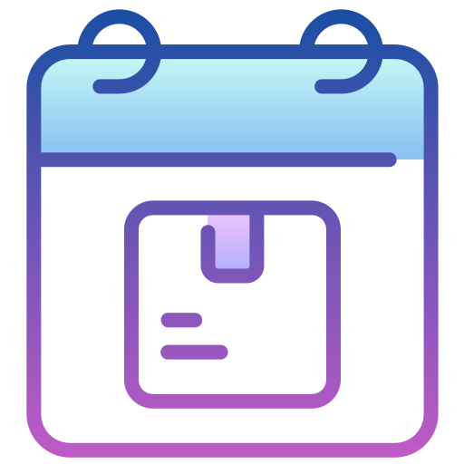

<!-- LOGO -->
 

  

<h1 align="center">Programme de formation</h1>

  

    Présentation du déroulement et des sujets abordés
     
    <a href="https://github.com/sqqyqqh/intro-blockchain/issues">Reporter un bug</a>
    —
    <a href="https://github.com/sqqyqqh/intro-blockchain/issues">Demander une amélioration</a>
  

## Déroulement
### Journée type
Le matin, nous nous concentrerons sur les aspects théoriques de la blockchain (fonctionnement, applications, limites). L'après-midi, nous travaillerons sur des exercices pratiques qui contribueront à la bonne maîtrise des principes fondamentaux.

### Notation
La barème de notation /20 est celui-ci :
* __Participation, contribution (2,5 points) :__ pour la participation lors des sessions de formations (questions, réponses etc.) et les différentes contributions au dépôt.
* __Travaux pratiques de l'après-midi (7,5 points) :__ concerne la pratique en semi-autonomie (possibilité d'échanger entre apprenants, de travailler en groupe) des différentes activités de l'après-midi. 
* __Q.C.M. final (10 points) :__ les questionnaire théorique qui concernera l'ensemble de la formation et se basant sur les ressources présentes sur ce dépôt.

## Thèmes abordés
### 🔗 Les concepts fondamentaux
_Introduction à la blockchain et à ses concepts fondamentaux._ Dans cette première journée, nous présenterons les concepts clés de la blockchain, comme la cryptographie, la décentralisation, les registres distribués, les contrats intelligents, l'immuabilité, le consensus, etc. Nous présenterons également les différents types de blockchains, comme les blockchains publiques, privées et hybrides, et leur utilisation dans divers domaines.

### 📊 La finance et le commerce
_Utilisation de la blockchain dans les applications de finance et de commerce._ Dans cette deuxième journée, nous présenterons les applications de la _blockchain_ dans les domaines de la finance et du commerce, comme les systèmes de paiement, les échanges de crypto-actifs, les marchés de la supply chain, etc. Nous présenterons également des exemples concrets d'applications _blockchain_ dans ces domaines.

### 🎛 L'Internet des objets
_Utilisation de la blockchain dans les applications de l'Internet des objets ("IoT", "Internet of Things") et de la gestion de l'identité._ Dans cette troisième journée, nous présenterons les applications de la _blockchain_ dans les domaines de l'_IoT_ et de la gestion de l'identité. Nous traiterons de la façon dont la _blockchain_ peut être utilisée pour sécuriser les communications entre les objets connectés et pour gérer les identités numériques de manière fiable et sécurisée.

### 🌱 Énergie et environnement
_Utilisation de la blockchain dans les applications de l'énergie et de l'environnement._ Dans cette quatrième journée, nous présenterons les applications de la _blockchain_ dans les domaines de l'énergie et de l'environnement, comme les systèmes de trading d'énergie, les registres de droits de l'environnement, etc. Nous présenterons également des exemples concrets d'applications _blockchain_ dans ces domaines.

### 🛠 QCM, prospective, questions/réponses

