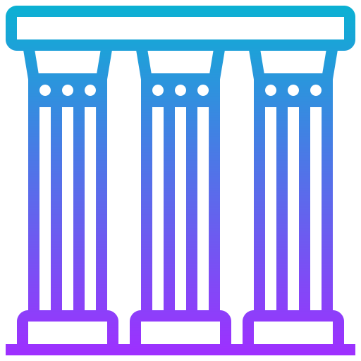

<!-- LOGO -->
 

  

<h1 align="center">Fondamentaux de la blockchain</h1>

  

    Les clés pour comprendre la blockchain
     
    <a href="https://github.com/sqqyqqh/intro-blockchain/issues">Reporter un bug</a>
    —
    <a href="https://github.com/sqqyqqh/intro-blockchain/issues">Demander une amélioration</a>
  

## 🔗 Qu'est-ce qu'une _blockchain_ ?
Une _blockchain_ est un type de base de données distribuée qui enregistre l'historique des transactions de manière permanente et sécurisée. Elle est généralement utilisée pour enregistrer les transactions financières, mais elle peut être utilisée pour enregistrer toute sorte de données de manière sécurisée et permanente.

Le fonctionnement d'une _blockchain_ repose sur un réseau de nœuds informatiques qui sont connectés entre eux. Chaque nœud dans le réseau contient une copie complète de la base de données, ce qui permet de vérifier l'intégrité des données en cas de divergence.

Lorsqu'une nouvelle transaction est effectuée, elle est vérifiée par les différents nœuds du réseau pour s'assurer qu'elle est valide. Une fois qu'une transaction est validée, elle est incluse dans un bloc de données, qui est ensuite ajouté à la _blockchain_.

Le processus d'ajout de nouveaux blocs à la _blockchain_ est géré par des algorithmes complexes qui utilisent la cryptographie pour s'assurer que les données sont sécurisées et que la _blockchain_ est immuable. Cela signifie que les données stockées dans la _blockchain_ ne peuvent pas être modifiées ou supprimées, ce qui en fait un moyen fiable et sécurisé pour enregistrer des transactions.

En résumé, le fonctionnement d'une _blockchain_ repose sur un réseau de nœuds informatiques qui enregistrent et vérifient les transactions, et utilisent la cryptographie pour s'assurer que les données sont sécurisées et immuables.

## ⏳ Histoire et philosophie
Comme souvent, nous devons cette évolution technologique à plusieurs courants de pensée dont essentiellement les mouvements _cypherpunks_ et libertariens agoristes.

### Les _cypherpunks_
Les cypherpunks sont un groupe de personnes intéressées par la cryptographie, la technologie et les idées liées à la vie privée et à la liberté en ligne. Ils ont été très actifs dans les années 1990, lorsque les premières technologies de cryptographie à clé publique ont été mises au point, et ils ont joué un rôle important dans le développement de ces technologies.

Les cypherpunks sont souvent considérés comme des partisans de la vie privée en ligne et de la liberté d'expression sur Internet. Ils sont également intéressés par les implications sociales et politiques de la technologie et du cryptage, et ils ont contribué à la création de nouvelles technologies pour protéger la vie privée des utilisateurs d'Internet.

Le terme "cypherpunk" a été inventé par un membre de ce groupe, Eric Hughes, dans son manifeste "A Cypherpunk's Manifesto" publié en 1993. Ce manifeste a servi de base à la philosophie des cypherpunks et a établi les bases de leur engagement en faveur de la vie privée et de la liberté en ligne.

Bien que le groupe de cypherpunks ait été très actif dans les années 1990, il est moins organisé aujourd'hui. Cependant, les idées et les technologies qu'ils ont développées continuent d'avoir un impact important dans le monde de la technologie et de la cryptographie.

### Libertarianisme, agorisme
Les libertariens sont des personnes qui croient en la liberté individuelle et en la limitation des pouvoirs de l'État. Ils sont souvent considérés comme des partisans de l'anarchisme ou de l'anarcho-capitalisme, c'est-à-dire qu'ils soutiennent l'idée qu'il faut limiter autant que possible l'influence et l'intervention de l'État dans la vie des citoyens.

Les libertariens sont généralement favorables à des politiques économiques libérales, comme la réduction des impôts et des dépenses publiques, la privatisation des services publics et la libre entreprise. Ils sont également favorables à des politiques sociales qui limitent l'intervention de l'État dans les affaires privées des citoyens, comme le droit à l'autodétermination et la liberté d'expression.

Les libertariens croient que l'individu est la meilleure source de savoir et de bien-être, et qu'il faut donc limiter autant que possible l'intervention de l'État dans les affaires des citoyens. Ils soutiennent également l'idée que la liberté individuelle est un droit fondamental, et qu'il faut donc protéger les droits des individus contre l'oppression de l'État ou d'autres groupes.

Les agoristes sont des personnes qui soutiennent l'idée d'une société sans État, où les individus sont libres de faire des échanges économiques sans intervention de l'État. Le mot "agoriste" vient du mot grec "agora", qui signifie "marché" ou "place publique", et les agoristes soutiennent que la société serait mieux organisée sous la forme d'un marché libre et ouvert, plutôt que sous celle d'un État centralisé.

Les agoristes sont souvent considérés comme des libertariens radicaux, c'est-à-dire des personnes qui soutiennent des idées très libertariennes et qui sont favorables à une réduction significative de l'influence et de l'intervention de l'État dans la société. Ils sont également souvent associés à l'anarcho-capitalisme, c'est-à-dire à l'idée que la société fonctionnerait mieux sans État et que les échanges économiques devraient être régulés uniquement par le marché.

Les agoristes soutiennent que l'État est une force oppressante qui limite la liberté individuelle et qui favorise l'injustice économique. Ils sont donc favorables à des politiques qui réduisent l'influence de l'État et qui encouragent la liberté individuelle et l'échange libre et ouvert. Ils sont également souvent critiques envers les gouvernements et les politiques publiques, qu'ils considèrent comme des obstacles à la liberté individuelle et à la justice économique.

### Satoshi Nakamoto
L'idée de base de la _blockchain_ a été présentée pour la première fois en 2008 dans un document publié sous le pseudonyme de _Satoshi Nakamoto_. Ce document décrivait un nouveau système de transaction électronique, appelé "Bitcoin", qui utilisait la technologie de la blockchain pour permettre aux utilisateurs de faire des transactions de manière sécurisée sans avoir besoin d'un tiers de confiance, comme une banque.

Depuis, la technologie de la blockchain a évolué et a été utilisée dans de nombreux domaines différents, allant des monnaies numériques aux contrats intelligents en passant par la gestion de la chaîne d'approvisionnement. La blockchain est considérée comme une technologie révolutionnaire en raison de sa capacité à permettre des transactions sécurisées et transparentes sans avoir besoin d'une autorité centrale.

Cependant, la technologie de la blockchain n'est pas sans controverses. Certaines personnes s'inquiètent des conséquences potentielles pour la vie privée des utilisateurs, en particulier en ce qui concerne la confidentialité des données financières. D'autres s'inquiètent des implications énergétiques de la technologie, en particulier en ce qui concerne le fait que de nombreuses blockchain utilisent des "preuves de travail" qui consomment beaucoup d'énergie. Malgré ces préoccupations, la technologie de la blockchain continue d'évoluer et de trouver de nouvelles utilisations.

## 💾 Enregistrements distribués
Les termes "centralisé", "décentralisé" et "distribué" font référence à la manière dont les informations et les données sont organisées et gérées dans un système.

Un système centralisé est un système où toutes les informations et les données sont stockées et gérées par une seule entité, généralement un ordinateur central. Cela signifie que cette entité a un contrôle absolu sur les informations et les données et décide comment elles sont utilisées et partagées.

Un système décentralisé, en revanche, est un système où les informations et les données sont stockées et gérées par plusieurs entités différentes. Cela signifie qu'il n'y a pas d'entité centrale qui contrôle toutes les informations et les données, ce qui permet à chaque entité de prendre des décisions indépendamment des autres.

Un système distribué, enfin, est un système où les informations et les données sont partagées et gérées par chacune des entités. Ces entités travaillent ensemble de manière coordonnée pour atteindre un objectif commun. Dans ce type de système, les informations et les données peuvent être partagées et utilisées de manière transparente par toutes les entités.

    
  </a>

La _blockchain_ est un registre distribué, c'est-à-dire que les données sont enregistrées et partagées entre plusieurs ordinateurs (ou nœuds) au sein d'un réseau. Cela signifie que les données sont immuables et sécurisées, car elles ne peuvent pas être modifiées ou supprimées par un seul ordinateur ou utilisateur.

## 🔏 Cryptographie
À ne pas confondre avec la cryptologie, la cryptographie est l'art de chiffrer les données et les communications afin de les protéger. La _blockchain_ utilise la cryptographie pour sécuriser les transactions et les enregistrements, en utilisant des clés publiques et privées pour authentifier les utilisateurs et les transactions.

## 🤝 Consensus
Le consensus est le processus par lequel les nœuds d'un réseau _blockchain_ s'entendent sur la validité des transactions et enregistrent celles-ci dans des blocs, qui sont ensuite ajoutés à la chaîne de blocs. Cela permet de garantir la fiabilité et la sécurité des données sur la blockchain, en s'assurant que les transactions sont valides et authentiques.

## 🧠 Contrats intelligents (_smart contracts_)
Un contrat intelligent est un programme informatique qui peut être exécuté sur une blockchain. Ces programmes sont écrits dans un langage de programmation spécial et peuvent être utilisés pour automatiser des processus complexes et effectuer des actions spécifiques en fonction de conditions prédéfinies.

Les contrats intelligents sont souvent utilisés pour mettre en œuvre des accords ou des règles définis dans un contrat électronique. Par exemple, un contrat intelligent peut être utilisé pour transférer automatiquement des fonds d'un compte à un autre lorsqu'une condition spécifique est remplie, comme le paiement d'une facture ou la réalisation d'une transaction.

Les contrats intelligents ont l'avantage d'être sécurisés, transparents et immuables, grâce à la technologie blockchain. Ils peuvent également être exécutés de manière autonome, sans intervention humaine, ce qui les rend particulièrement utiles pour automatiser des processus complexes et réduire les risques d'erreur.

## 🔓 Ouverture
_Les blockchains publiques, privées et hybrides sont trois types de blockchains qui diffèrent par leur accessibilité et leur utilisation._ 

### Blockchains publiques
Les blockchains publiques sont des réseaux ouverts qui sont accessibles à tous les utilisateurs. Ces réseaux permettent à n'importe qui de consulter les données enregistrées sur la blockchain, d'effectuer des transactions ou de développer des applications. Les blockchains publiques sont souvent utilisées pour les crypto-monnaies, comme le Bitcoin ou l'Ethereum.

### Blockchains privées
Les blockchains privées sont des réseaux fermés qui sont gérés par une organisation ou une entreprise. Ces réseaux ne sont accessibles qu'aux utilisateurs autorisés, et leur utilisation est soumise à des règles et des politiques définies par l'organisation qui gère la blockchain. Les blockchains privées sont souvent utilisées pour les applications d'entreprise, comme la gestion de la chaîne d'approvisionnement ou la gestion des ressources humaines.

### Blockchains hybrides
Une _blockchain_ hybride est un type de _blockchain_ qui combine les caractéristiques des blockchains publiques et privées. En d'autres termes, une _blockchain_ hybride est un réseau qui est partiellement ouvert et partiellement fermé.

Les blockchains hybrides ont l'avantage d'offrir une plus grande flexibilité et de permettre une utilisation plus adaptée aux besoins de l'utilisateur. Par exemple, une _blockchain_ hybride peut être utilisée pour des applications d'entreprise qui nécessitent une sécurité accrue, tout en permettant à certains utilisateurs externes d'accéder à certaines données ou fonctionnalités.

En général, les blockchains hybrides sont utilisées pour des applications qui nécessitent un niveau élevé de sécurité et de confidentialité, tout en offrant une certaine flexibilité et une utilisation partagée. Elles peuvent être utilisées dans divers domaines, comme la finance, la supply chain ou l'Internet des objets.