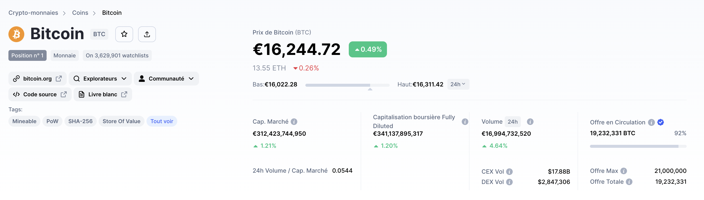

<!-- LOGO -->
 

  

<h1 align="center">Économie, Finance et Commerce</h1>

  

    Une application essentielle de la blockchain
     
    <a href="https://github.com/sqqyqqh/intro-blockchain/issues">Reporter un bug</a>
    —
    <a href="https://github.com/sqqyqqh/intro-blockchain/issues">Demander une amélioration</a>
  

## 💶 Blockchain et économie
### Impact
La blockchain est un outil qui peut avoir un impact important sur l'économie et la finance en facilitant les transactions en ligne et en offrant un moyen fiable et sécurisé pour enregistrer des contrats et des transactions. Elle peut également permettre de créer de nouvelles formes de monnaie, comme les crypto-monnaies, qui peuvent être utilisées pour faciliter les échanges commerciaux. En outre, la technologie blockchain peut être utilisée pour créer des plates-formes décentralisées qui permettent aux utilisateurs de contrôler directement leurs actifs et leurs données, ce qui peut avoir des répercussions importantes sur les modèles économiques traditionnels. En bref, la blockchain est un outil qui peut potentiellement changer la façon dont l'économie fonctionne en facilitant les transactions, en offrant de nouvelles formes de monnaie et en créant des plates-formes décentralisées.

### Souveraineté économique
La technologie blockchain peut potentiellement mettre en danger la souveraineté des États sur la monnaie en permettant la création de nouvelles formes de monnaie, comme les crypto-monnaies, qui ne sont pas contrôlées par les banques centrales ou les gouvernements. Cela peut entraîner une perte de contrôle des autorités sur la circulation de la monnaie et sur les taux d'intérêt, ce qui peut avoir des répercussions sur l'économie. Cependant, il est important de noter que la technologie blockchain en elle-même ne menace pas la souveraineté des États sur la monnaie, mais plutôt les nouvelles formes de monnaie qui peuvent en être créées

Les monnaies digitales de banques centrales (aussi appelées monnaies numériques de banques centrales ou CBDC en anglais) sont des monnaies virtuelles émises et contrôlées par les banques centrales. Elles sont conçues pour être utilisées comme un moyen de paiement électronique alternatif aux espèces et aux autres formes de monnaie traditionnelles, comme les billets de banque et les pièces de monnaie. Les CBDC peuvent être utilisées pour effectuer des transactions en ligne ou pour stocker de la valeur numérique, comme les crypto-monnaies. Plusieurs banques centrales à travers le monde étudient actuellement la possibilité de lancer leur propre monnaie digitale, mais aucune n'a encore lancé de CBDC à grande échelle.

### Marché noir
La technologie blockchain peut potentiellement être utilisée pour faciliter les transactions sur les marchés noirs, c'est-à-dire les marchés illégaux où les biens et services sont vendus et achetés de manière illégale. La blockchain offre un moyen fiable et sécurisé pour enregistrer les transactions et échanger des fonds de manière anonyme, ce qui peut attirer les utilisateurs des marchés noirs. Cependant, il est important de noter que la technologie blockchain en elle-même n'est pas liée au marché noir et ne l'encourage pas. En fait, la blockchain peut également être utilisée pour lutter contre les activités illégales en permettant aux autorités de mieux suivre et d'identifier les transactions suspectes. En bref, la technologie blockchain peut potentiellement être utilisée sur les marchés noirs, mais elle peut également être utilisée pour lutter contre ces activités illégales.

### Blanchiment

## 🪙 Capitalisations
### Bitcoin
Bitcoin est la première crypto-monnaie créée en 2008 par un individu ou un groupe connu sous le nom de _Satoshi Nakamoto_. La création de Bitcoin a été motivée par le besoin de mettre en place un système monétaire décentralisé et accessible à tous, indépendamment des institutions financières traditionnelles. Depuis sa création, Bitcoin a connu un grand succès et est devenu l'une des principales crypto-monnaies sur le marché, avec une capitalisation boursière importante. Cependant, il a également suscité des controverses en raison de son utilisation dans des activités illégales, de sa volatilité, et de la complexité de sa technologie.

Bitcoin est une forme de monnaie numérique décentralisée conçue pour permettre des transactions financières en ligne. Contrairement aux monnaies traditionnelles, qui sont émises et gérées par les gouvernements, Bitcoin est basé sur un système de technologie de registre distribué appelé blockchain, qui permet de stocker les transactions de manière sécurisée et d'assurer l'anonymat des utilisateurs. Bitcoin a été créé en 2009 par une personne ou un groupe de personnes utilisant le pseudonyme de Satoshi Nakamoto. Depuis lors, il est devenu l'une des formes de monnaie numérique les plus populaires au monde.

### Ethereum
Ethereum est une plate-forme de développement décentralisée qui permet aux développeurs de construire et déployer des applications décentralisées (dApps). Contrairement à d'autres plateformes de développement, Ethereum permet aux utilisateurs de créer des applications qui utilisent la technologie blockchain pour stocker et traiter les données. Ethereum utilise également sa propre monnaie numérique, appelée "éther", qui peut être utilisée pour payer les frais de transaction sur la plateforme. Ethereum a été lancé en 2015 et est depuis devenu l'une des principales plateformes de développement décentralisé au monde.

Il existe plusieurs différences techniques entre Bitcoin et Ethereum. Tout d'abord, Bitcoin et Ethereum utilisent des technologies de registre distribué différentes. Bitcoin utilise un registre appelé "blockchain", tandis qu'Ethereum utilise un registre appelé "tangle". En outre, Bitcoin a été conçu principalement comme une monnaie numérique, alors qu'Ethereum a été conçu comme une plate-forme de développement décentralisée permettant aux utilisateurs de créer des applications décentralisées.

## 💳 Blockchain et paiement
### Distributeurs automatiques
Il existe des distributeurs automatiques de billets (ATM) pour les crypto-monnaies. Ces ATM permettent aux utilisateurs de retirer des crypto-monnaies en échange de devises fiduciaires, comme l'euro ou le dollar. Ils fonctionnent de la même manière que les ATM traditionnels, à la différence près que les utilisateurs peuvent acheter des crypto-monnaies au lieu de retirer de l'argent. Ces ATM sont généralement situés dans les grandes villes et les centres commerciaux populaires, et leur nombre a considérablement augmenté ces dernières années en raison de l'intérêt croissant pour les crypto-monnaies.

### Ripple
Ripple est un protocole de paiement en ligne qui utilise la technologie blockchain pour faciliter les transactions financières entre les utilisateurs et les institutions financières. Il vise à offrir une solution de paiement rapide, sécurisée et économique pour les transactions internationales, en particulier pour les transferts de fonds entre les banques. Ripple a été lancé en 2012 et est maintenant utilisé par plusieurs grandes institutions financières dans le monde entier. Le protocole Ripple repose sur un réseau de serveurs distribués qui enregistrent et synchronisent les transactions en temps réel, ce qui permet d'éliminer les frais élevés et les délais de traitement associés aux transferts internationaux traditionnels.

### Litecoin
Litecoin est une crypto-monnaie similaire à Bitcoin, créée en 2011 par un développeur informatique du nom de _Charlie Lee_. Elle utilise la technologie blockchain pour enregistrer les transactions et sécuriser les échanges entre les utilisateurs. Litecoin se distingue de Bitcoin par des transactions plus rapides et un système de minage plus efficace. Le temps de traitement d'une transaction Litecoin est environ quatre fois plus rapide que celui d'une transaction Bitcoin, ce qui en fait une option intéressante pour les paiements en ligne. De plus, Litecoin utilise un algorithme de minage différent de celui utilisé par Bitcoin, ce qui permet aux utilisateurs de participer au processus de minage en utilisant des matériels moins coûteux et plus faciles à obtenir. Litecoin est l'une des crypto-monnaies les plus populaires et est largement acceptée comme moyen de paiement en ligne.

### Cardano
Cardano est une plate-forme de blockchain qui a été conçue pour fournir une meilleure fonctionnalité et une plus grande évolutivité que les autres plateformes blockchain existantes. Elle a été développée par une équipe de chercheurs et d'experts en technologie dirigée par Charles Hoskinson, co-fondateur d'Ethereum. Cardano utilise une technologie de consensus appelée preuve d'enjeu (PoS) pour valider les transactions sur la blockchain, ce qui la rend plus efficace et écologique que d'autres blockchains qui utilisent la preuve de travail (PoW). En outre, Cardano est également conçu pour être plus sécurisé et plus adaptable aux changements, ce qui en fait une plateforme très intéressante pour les développeurs et les utilisateurs.

## 🔄 Plate-formes d'échange (_exchanges_)
Les plateformes d'échange de crypto-monnaies sont des sites en ligne qui permettent aux utilisateurs d'acheter, de vendre et de stocker des crypto-monnaies. Elles fonctionnent comme des intermédiaires entre les acheteurs et les vendeurs, en leur offrant une plateforme sécurisée où ils peuvent effectuer des transactions en toute sécurité. Beaucoup de ces plateformes permettent également aux utilisateurs d'échanger des crypto-monnaies contre des devises fiduciaires, comme l'euro ou le dollar. Il existe un grand nombre de plateformes d'échange de crypto-monnaies différentes, chacune ayant ses propres avantages et inconvénients en termes de sécurité, de frais, de facilité d'utilisation et de liquidité.

Il existe un grand nombre de plateformes d'échange de crypto-monnaies différentes, et la popularité de chacune varie en fonction de divers facteurs. Certaines des plateformes d'échange de crypto-monnaies les plus populaires comprennent Coinbase, Binance, FTX, Kraken, Bitstamp et Gemini. Ces plateformes sont populaires en raison de leur sécurité, de leur facilité d'utilisation et de leur large gamme de crypto-monnaies proposées. Cependant, il est important de faire des recherches approfondies avant de choisir une plateforme d'échange, car il existe également de nombreuses plateformes moins fiables sur lesquelles il est préférable de ne pas investir.

### Coinbase
Coinbase est une plateforme d'échange de crypto-monnaies très populaire aux États-Unis. Elle a été fondée en 2012 et est basée à San Francisco, en Californie. Coinbase est l'une des plateformes d'échange de crypto-monnaies les plus faciles à utiliser, ce qui en fait un choix populaire pour les débutants dans le domaine des crypto-monnaies. Elle propose également un grand nombre de crypto-monnaies différentes, ainsi que des options pour acheter des crypto-monnaies avec des cartes de crédit et de débit. En plus de son échange de crypto-monnaies, Coinbase offre également des services de stockage en froid pour les utilisateurs soucieux de la sécurité de leurs actifs numériques.

### Binance
Binance est une plateforme d'échange de crypto-monnaies très populaire. Elle a été fondée en 2017 par Changpeng Zhao et est basée à Hong Kong. Binance est réputée pour sa vaste gamme de crypto-monnaies proposées, sa facilité d'utilisation et sa grande liquidité. Elle offre également des frais de transaction très compétitifs, ce qui en fait une plateforme attrayante pour les traders et les investisseurs. En plus de son échange de crypto-monnaies, Binance propose également une gamme de produits financiers dérivés, tels que des contrats à terme et des options, qui permettent aux utilisateurs de spéculer sur les prix des crypto-monnaies.

### L'affaire FTX
