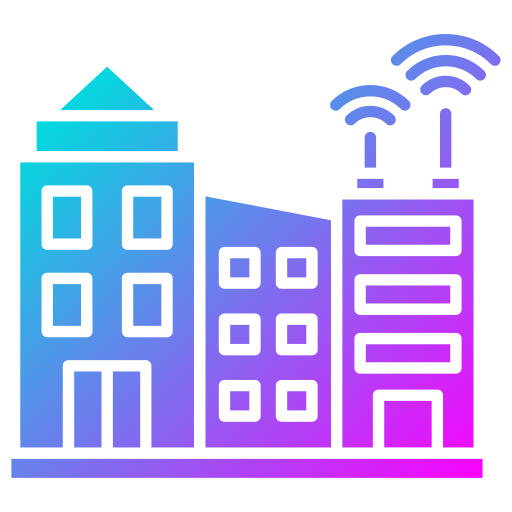

<!-- LOGO -->
 

  

<h1 align="center">Internet des objets et villes intelligentes</h1>

  

    Vie quotidienne entre ville et domicile
     
    <a href="https://github.com/sqqyqqh/intro-blockchain/issues">Reporter un bug</a>
    —
    <a href="https://github.com/sqqyqqh/intro-blockchain/issues">Demander une amélioration</a>
  

## 💡 Internet des Objets
L'Internet des objets (IoT en anglais) est un terme qui désigne un réseau de dispositifs connectés, tels que des appareils électroniques, des véhicules, des objets de la vie quotidienne, etc., qui peuvent collecter, échanger et partager des données en utilisant des technologies sans fil. L'objectif de l'IoT est d'offrir une connectivité en temps réel à des objets du monde physique, permettant ainsi de les rendre plus intelligents et de les intégrer dans des systèmes plus larges. Cela peut se traduire par des avancées dans de nombreux domaines, tels que la santé, la domotique, la mobilité, l'agriculture, etc.

Dans le contexte de l'IoT, la blockchain peut être utilisée pour sécuriser les données collectées par les objets connectés, en garantissant leur intégrité et leur confidentialité. Elle peut également offrir un moyen de validation des transactions entre les différents dispositifs, ce qui peut faciliter la création de services et d'applications basés sur l'IoT.

Il est difficile de dire quels sont les projets IoT basés sur la blockchain les plus populaires, car cela dépend de différents facteurs, tels que l'échelle du projet, les domaines d'application, le niveau d'adoption, etc. Il existe cependant un certain nombre de projets IoT qui utilisent la blockchain dans divers domaines, tels que la santé, la logistique, la mobilité, l'énergie, etc. Par exemple, il y a des projets qui utilisent la blockchain pour sécuriser les données de santé collectées par des dispositifs portables, ou pour faciliter la gestion de la chaîne d'approvisionnement dans l'industrie manufacturière. Il y a également des projets qui utilisent la blockchain pour créer des réseaux de véhicules autonomes, ou pour améliorer l'efficacité des systèmes d'énergie renouvelable.

Les utilisations principales de l'IoT comprennent :

- La surveillance à distance des appareils et des équipements pour améliorer l'efficacité et la sécurité.
- La collecte de données en temps réel sur l'environnement et les conditions météorologiques pour améliorer la précision des prévisions et la planification des activités.
- L'automatisation des tâches ménagères et des procédures de sécurité dans les maisons et les bâtiments pour améliorer le confort et la sécurité des occupants.
- La gestion de la chaîne d'approvisionnement pour améliorer l'efficacité et la traçabilité des produits.
- Le suivi des données de santé pour améliorer la prévention et le traitement des maladies.
Il existe de nombreuses autres utilisations de l'IoT, en fonction des besoins et des objectifs de chaque organisation ou individu.

### Santé
L'IoT est de plus en plus utilisé dans le domaine de la santé pour améliorer la prévention, le diagnostic et le traitement des maladies. Grâce à des objets connectés tels que des montres intelligentes, des dispositifs portables de suivi de la santé et des capteurs de mouvement, il est possible de collecter en temps réel des données sur les activités, les signes vitaux et l'environnement des patients.

Ces données peuvent être utilisées pour fournir des alertes en cas de problèmes de santé potentiels, pour suivre l'évolution des maladies chroniques et pour aider les professionnels de la santé à prendre des décisions de traitement plus informées. L'IoT peut également être utilisé pour connecter les patients à distance à des professionnels de la santé, permettant ainsi des consultations en ligne et un suivi plus fréquent sans nécessiter de se rendre physiquement dans un cabinet médical.

En somme, l'IoT offre de nombreuses possibilités pour améliorer la qualité des soins de santé en permettant une surveillance plus précise et une prise de décision plus rapide. Cependant, il est important de noter que l'utilisation de l'IoT dans le domaine de la santé soulève également des questions en matière de confidentialité et de sécurité des données.

### Domotique
La domotique est le domaine d'application de l'IoT qui vise à automatiser les tâches ménagères et les procédures de sécurité dans les maisons et les bâtiments. Grâce à des objets connectés tels que des thermostats intelligents, des détecteurs de mouvement et des serrures connectées, il est possible de contrôler et surveiller à distance les équipements et les appareils domestiques.

Cela permet de simplifier les tâches quotidiennes, comme régler la température de la maison ou verrouiller les portes, et d'améliorer le confort et la sécurité des occupants. Par exemple, un thermostat intelligent peut apprendre les préférences en matière de température des occupants et ajuster automatiquement la température en conséquence, tandis qu'un détecteur de mouvement peut envoyer une alerte en cas d'intrusion non autorisée.

En somme, l'IoT offre de nombreuses possibilités pour rendre les maisons et les bâtiments plus intelligents et plus faciles à gérer, tout en améliorant le confort et la sécurité des occupants. Cependant, il est important de noter que l'utilisation de l'IoT dans la domotique peut également poser des défis en matière de sécurité des données et de confidentialité.

### IOTA
Le projet [IOTA](https://iota.org) est une initiative de technologie blockchain qui vise à offrir une solution de transaction décentralisée pour l'Internet des objets (IoT). Le projet IOTA utilise une technologie de type "tangle" dont la strcuture est un "DAG" (Directed Acyclic Graph ou Graphe orienté acyclique) qui diffère des technologies blockchain classiques, en permettant un niveau élevé de scalabilité et en offrant des transactions gratuites. Le projet IOTA a pour objectif de créer un écosystème d'applications et de services pour l'IoT, en utilisant la technologie de tangle pour faciliter la communication et les transactions entre les différents dispositifs connectés.

Un DAG (pour acyclic directed graph) est une structure de données qui peut être utilisée pour modéliser les relations entre les éléments d'un ensemble. Un DAG est une sorte de graphe orienté, dans lequel les relations entre les éléments sont définies par des arcs, et où il n'y a pas de cycles (c'est-à-dire de suites d'arcs qui reviennent à un élément déjà parcouru).

Dans le contexte de la blockchain, un DAG peut être utilisé pour représenter les relations entre les différentes transactions, en établissant des liens entre les différents blocs de la chaîne. La technologie de tangle utilisée par le projet IOTA repose sur un DAG, qui permet de stocker et de valider les transactions de manière décentralisée. Le DAG offre des avantages en termes de scalabilité et de rapidité des transactions, ce qui peut être utile dans le contexte de l'IoT.

## 🌃 Villes intelligentes
Une ville intelligente est un concept qui désigne une ville qui utilise des technologies avancées pour améliorer la qualité de vie de ses habitants, en offrant des services plus efficaces et en favorisant le développement durable. Cela peut se traduire par l'utilisation de dispositifs connectés pour collecter et analyser des données en temps réel, afin de prendre des décisions plus informées et de mettre en place des services plus adaptés aux besoins des citoyens. Par exemple, une ville intelligente peut utiliser des capteurs pour surveiller l'état de la circulation routière, ou pour gérer l'éclairage public en fonction de la présence de personnes dans les rues. L'objectif d'une ville intelligente est de créer un environnement plus agréable et plus durable pour les habitants.

Il existe un certain nombre de liens entre les villes intelligentes et la blockchain. Dans le contexte des villes intelligentes, la blockchain peut être utilisée pour sécuriser les données collectées par les dispositifs connectés, en garantissant leur intégrité et leur confidentialité. Elle peut également offrir un moyen de validation des transactions entre les différents dispositifs, ce qui peut faciliter la mise en place de services et d'applications basés sur l'IoT.

En outre, la blockchain peut également être utilisée pour améliorer la gouvernance des villes intelligentes, en offrant un moyen de stocker et de consulter les données de manière transparente et sécurisée. Cela peut faciliter la participation des citoyens à la prise de décision, en leur permettant de contribuer aux différents projets et initiatives de la ville.

Enfin, la blockchain peut également être utilisée pour faciliter la collaboration entre les différents acteurs des villes intelligentes, en créant des plateformes de partage des données et des services qui peuvent être utilisées par les différents organismes et entreprises.

Cependant, la blockchain peut également être utilisée pour enregistrer et suivre les données personnelles des individus, ce qui peut poser des problèmes en termes de protection de la vie privée. Dans ce cas, il est important de mettre en place des mesures de sécurité et de confidentialité pour protéger les données des citoyens, et d'éviter tout abus de la technologie. Il est également important de veiller à ce que les données collectées soient utilisées uniquement dans le cadre d'applications et de services qui sont légitimes et qui respectent les droits des citoyens.

Parmis les nombreuses applications possibles, il y a donc :
- Identification facilitée des citoyens (état civil, données de santé, permis, diplômes, etc.)
- Identification universelle (réseau mondial de passeports et cartes d'identités)
- Sécurisation des données collectées (reconnaissance faciale, données économiques, données de santé publique, etc.)
- Interconnexion avec différents objets connectés (_smartphones_, _smartwatches_, etc.)
- Gestion avancée et sécurité des panneaux (signalisations, publicitaires...)
- Transparence des données auprès du public (budget, décisions, etc.)
- Démocratie par la technologie (vote, prises de décision, etc.)
- Etc.

## 🤺 Défis
Il existe plusieurs défis liés à l'utilisation de la blockchain dans le domaine de l'IoT et des _smart cities_. L'un des principaux défis est lié à la scalabilité de la blockchain. En effet, les réseaux blockchain existants ont des limites en termes de capacité de traitement et de stockage, ce qui peut poser des problèmes pour traiter les volumes importants de données collectées par les objets connectés. Il y a également des problèmes liés à la consommation d'énergie, car les processus de validation des transactions sur la blockchain peuvent être gourmands en ressources.

Autre défi : la sécurité. Bien que la blockchain offre des avantages en termes de sécurité des données, elle peut également être exposée à des risques, tels que les attaques de type 51% ou les fuites de données. Il est donc important de mettre en place des mesures de sécurité adaptées pour protéger les données collectées par les objets connectés.

Enfin, un autre défi est lié à la complexité de la technologie blockchain. La blockchain peut être difficile à comprendre pour les utilisateurs non techniques, ce qui peut freiner l'adoption de l'IoT basé sur la blockchain. Il est donc important de mettre en place des outils et des services qui facilitent l'utilisation de la blockchain dans le domaine de l'IoT.

--- 
## Sources
* [How blockchain can empower smart cities - and why interoperability will be crucial](https://www.weforum.org/agenda/2021/04/how-blockchain-can-empower-smart-cities-gtgs21/) par le Forum Économique Mondial
